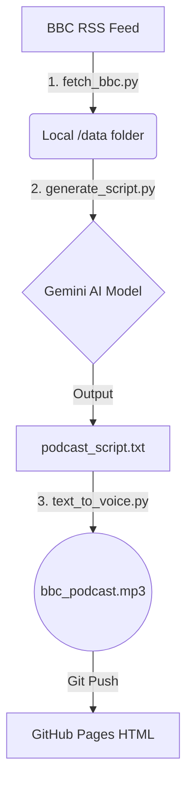

# 🏗️ Architecture Design

## 1. System Workflow
This project uses a "Separation of Concerns" architecture. Each step is a separate Python file.

## 2. Tech Stack
* **Data Ingestion:** Python `feedparser`
* **AI Engine:** Google Gemini SDK (`google-genai`)
* **TTS Engine:** Microsoft Edge TTS (`edge-tts`)
* **Frontend:** HTML/CSS
* **Hosting:** GitHub Pages

## 3. Folder Structure
- `/data/`: Stores raw news `.txt` files.
- `fetch_bbc.py`: Code to download news.
- `generate_script.py`: Code to call AI for scripting.
- `text_to_voice.py`: Code to make audio.
- `index.html`: The web interface.